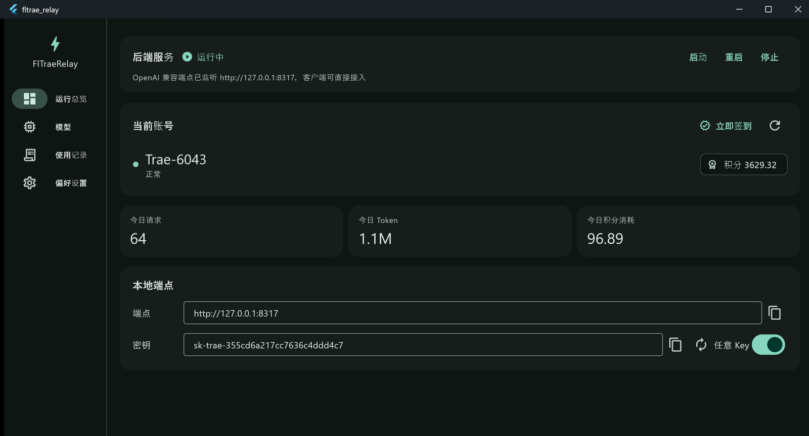
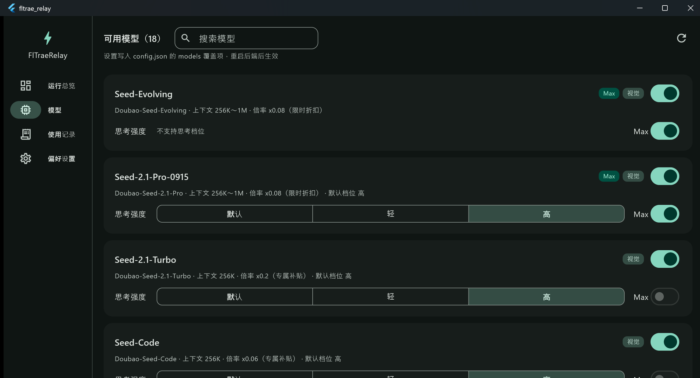
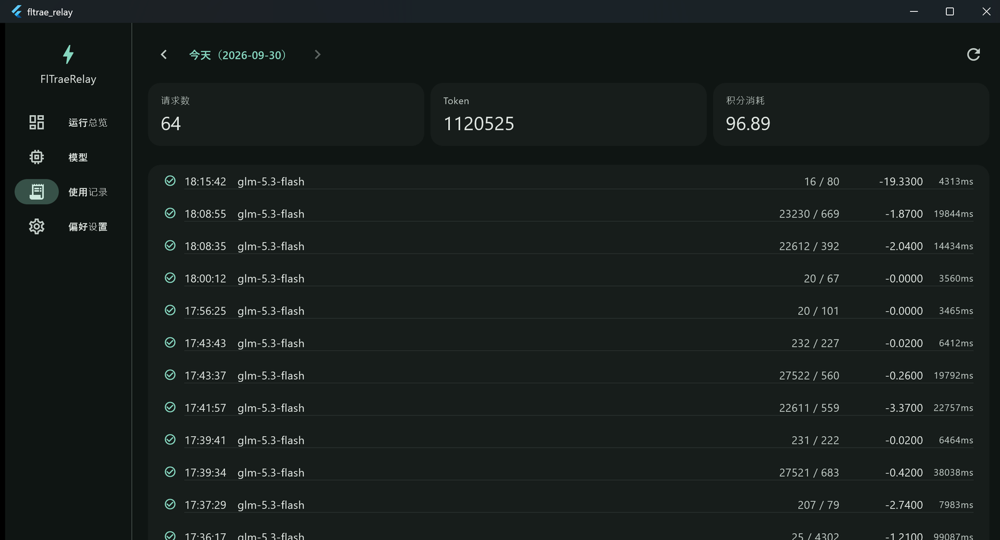
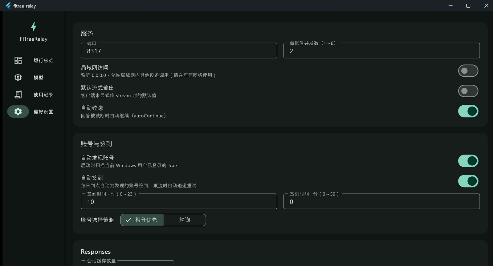

# FlTraeRelay

[](https://github.com/imalti0r/FlTraeRelay/releases/latest)
[](LICENSE)

Trae Relay 的 **Flutter 完全重写版**。将上游 [sdn205/Trae-Relay](https://github.com/sdn205/Trae-Relay)（C++ / Win32）的全部后端能力用 Dart 重新实现，配上 Material 3 桌面界面。

- **单进程自包含**：HTTP 服务器、Trae 账号发现与解密、上游代理、账号池全部内嵌在 Flutter 应用进程内，无外部后端、无 sidecar，打开即用。
- **仅使用当前 TRAE SOLO CN 客户端登录的账号**：其他发行版（Trae CN / Trae / Trae Work / 国际版）的账号不发现、不显示、不使用。

## 截图

| 运行总览 | 模型 |
| --- | --- |
|  |  |

| 使用记录 | 偏好设置 |
| --- | --- |
|  |  |

## 功能

- **OpenAI 兼容 API**（默认 `http://127.0.0.1:8317/v1`）
  - `/v1/chat/completions`：流式 SSE / 非流式、原生 function calling、`reasoning_content`、`stop` 本地截断、`stream_options.include_usage`
  - `/v1/responses`：基础兼容（instructions、多模态 input、流式 delta、usage）
  - `/v1/models`、`/v1/status`、`/health`；Bearer 与 `X-API-Key` 双鉴权、CORS
- **真流式**：逐帧实时到达；上游思考/排队期间空闲心跳保活；上游挂起 120 秒自动失败
- **账号**：自动发现并解密 TRAE SOLO CN 凭据（tc 格式 AES-128-CBC）、令牌自动刷新、积分实时同步、手动/自动签到（9074 限流退避重试）
- **配置热加载**：外部编辑 `%APPDATA%\FlTraeRelay\config.json` 自动生效（防抖重载，改端口外的配置免重启）
- **模型页**：模型目录自动拉取（成功每小时刷新、失败 5 分钟重试），每个模型行内直接设置思考强度（默认/轻/高/极高）、Max、启用状态
- **使用记录**：按日期浏览请求明细；**点开任意一条可查看完整发送消息、思考过程与回答内容**
- **偏好设置**：端口、局域网、并发数、签到时间、Responses 缓存、日志级别；`Ctrl+1..4` 快速切页

## 下载

到 [Releases](https://github.com/imalti0r/FlTraeRelay/releases/latest) 下载：

| 文件 | 说明 |
| --- | --- |
| `FlTraeRelay-v*-portable-win-x64.zip` | 便携版：解压即用 |
| `FlTraeRelay-v*-setup-win-x64.exe` | 安装版：向导安装，含桌面快捷方式 |

## 快速开始

1. 安装并登录 TRAE SOLO CN，确认能正常对话
2. 启动 FlTraeRelay——首次运行自动在 `%APPDATA%\FlTraeRelay` 生成 `config.json` 并生成 API Key
3. 客户端配置：

| 配置项 | 内容 |
| --- | --- |
| Base URL | `http://127.0.0.1:8317/v1` |
| API Key | "运行总览"中的密钥（可复制/重新生成） |
| 模型 | 模型页列表中的 `config_name` |

## 使用环境

- Windows 10/11 x64
- 当前 Windows 用户已安装并登录 TRAE SOLO CN
- 能连接 Trae 上游服务

## 构建

```powershell
cd app
flutter pub get
flutter build windows --release --no-tree-shake-icons
# 或直接运行 tool\build.ps1；产物在 build\windows\x64\runner\Release\
```

> `--no-tree-shake-icons` 禁用图标字体裁剪：Flutter 的 tree-shake 会误删部分 `selectedIcon` 字形，导致侧边导航选中态图标空白。

安装包：安装 [Inno Setup](https://jrsoftware.org/isinfo.php) 后运行 `iscc dist_stage\installer.iss`。

## 上游同步

本仓库的 `src/`、`include/`、`CMakeLists.txt` 保留上游 C++ 原版（未被 Flutter 版使用，仅作对照与参照），可正常同步上游：

```bash
git pull upstream main
```

Dart 重写版对应关系见 [app/README.md](app/README.md) 的模块对照表。

## 本地数据

全部位于 `%APPDATA%\FlTraeRelay`（即 `C:\Users\<用户名>\AppData\Roaming\FlTraeRelay`）：

| 路径 | 内容 |
| --- | --- |
| `config.json` | 配置和 API Key（前端直接读写，未知字段保留） |
| `accounts/<userId>.json` | 账号私有快照（完整凭据 + 设备指纹，切号后多账号共存） |
| `usage/usage-YYYYMMDD.jsonl` | 使用记录（一行一条请求） |
| `usage/detail/usage-YYYYMMDD/*.json` | 每条请求的完整消息与回答详情 |

发布时只需分发 Release 目录；不要上传自己的配置、日志、会话缓存或账号资料。

## 许可与致谢

- 上游 [sdn205/Trae-Relay](https://github.com/sdn205/Trae-Relay) 提供了全部协议逆向成果（tc 解密盐、solo 通道、模型目录、签到流程）
- 本仓库在其基础上完成 Dart 移植与 Flutter 界面
